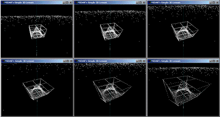



## A 3D Lesson v3\.1, Moderate

### Description

This is version three of my simple 3D lessons. The major update in this lesson, is the Virtual Camera code. You can move the camera anywhere (using the keyboard), and make the camera 'look at' a certain point. Only Dots between the Near and Far Clipping distances are visible. This 3D lesson includes some very advanced 'mathematical' topics, however I have listed the code as 'Moderate' or 'Intermediate' because you don't need to understand the advanced parts to have fun with this project.
 
### More Info
 

             |
---                |---
**Submitted On**   |2003-07-26 02:57:50
**By**             |[Peter Wilson](https://github.com/Planet-Source-Code/PSCIndex/blob/master/ByAuthor/peter-wilson.md)
**Level**          |Intermediate
**User Rating**    |5.0 (55 globes from 11 users)
**Compatibility**  |VB 6\.0
**Category**       |[Graphics](https://github.com/Planet-Source-Code/PSCIndex/blob/master/ByCategory/graphics__1-46.md)
**World**          |[Visual Basic](https://github.com/Planet-Source-Code/PSCIndex/blob/master/ByWorld/visual-basic.md)
**Archive File**   |[A\_3D\_Lesso1620267262003\.zip](https://github.com/Planet-Source-Code/peter-wilson-a-3d-lesson-v3-1-moderate__1-47162/archive/master.zip)

